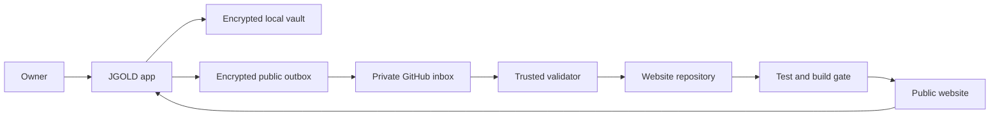

## Executive summary

The highest-risk boundary was the Samsung app holding a token able to write directly to the public website repository. The implemented GitHub-only design removes that authority from the phone: JGOLD can write only public manifests to a separate private inbox, while trusted website code validates, escapes, tests, and deploys them. Residual high-value risks are theft of the phone's limited inbox token, abuse of allowed public fields for defacement, and compromise of the trusted website workflow or GitHub account.

## Scope and assumptions

- In scope: `private-companion-app/src/domain/privacy.ts`, `private-companion-app/src/services/github-publishing.ts`, `private-companion-app/src/services/publication-outbox.ts`, `private-companion-app/src/storage/publishing-credentials.ts`, `scripts/sync-jgold-publications.js`, `.github/workflows/jgold-publish-sync.yml`, `.github/workflows/test.yml`, and `.github/workflows/deploy-pages.yml`.
- Runtime context: one owner, one Samsung S23 Ultra, a public GitHub Pages website, a private GitHub publishing inbox, and GitHub Actions.
- Data sensitivity: finances, private photos/files, notes, reading activity, highlights, and revision history are highly sensitive and must stay on the phone. Approved publication manifests are intended to become public.
- Authentication assumption: the owner creates a fine-grained token restricted to `JGOLD43/jgold-publishing-inbox` with only Contents read/write access and a short expiry.
- Explicitly out of scope: private-data backup/sync, multi-user publishing, rooted-device guarantees, GitHub platform compromise, and AI processing.
- User clarification: Firebase or another application backend is not permitted; GitHub must provide the synchronization and automation layer.

Open questions that could change risk ranking:

- Whether the Samsung device remains in Developer Access mode after active development; leaving biometric bypass enabled increases local compromise likelihood.
- Whether GitHub branch protection will permit the scheduled trusted workflow to push its validated data commit directly to `main`.

## System model

### Primary components

- JGOLD app: encrypted private storage, explicit public-copy construction, encrypted publication outbox, and GitHub inbox client. Evidence: `private-companion-app/src/storage/database.ts` (`publication_jobs`); `private-companion-app/src/domain/privacy.ts` (`PublishManifest`).
- Private publishing inbox: untrusted JSON-only staging repository. The phone has write access; the website has read-only deploy-key access. Evidence: `private-companion-app/src/storage/publishing-credentials.ts` (`jgold-publishing-inbox`); `.github/workflows/jgold-publish-sync.yml`.
- Trusted publication processor: exact-schema validation, bounds checking, HTML escaping, replay ledger, and allowlisted data-file mutation. Evidence: `scripts/sync-jgold-publications.js` (`validateEnvelope`, `applyManifest`).
- Website CI and Pages: tests a pushed trusted data commit and deploys only after the test workflow succeeds. Evidence: `.github/workflows/test.yml`; `.github/workflows/deploy-pages.yml`.
- Public website feeds: public books, essays, movies, and other data read by both browsers and the app. Evidence: `private-companion-app/src/services/public-books.ts`; `private-companion-app/src/services/public-site.ts`.

### Data flows and trust boundaries

- Owner input → JGOLD private database: private records and public drafts cross the Android UI/process boundary into SQLCipher and encrypted file storage; Android backup is disabled and keys use SecureStore/Keystore. Publication occurs only through explicit public manifest constructors.
- JGOLD outbox → GitHub inbox: approved manifest JSON and the inbox token cross HTTPS to GitHub; TLS and GitHub bearer authentication apply, with repository-level Contents scope. The client sends no vault objects or attachments.
- Private inbox → trusted website workflow: untrusted JSON crosses a Git checkout boundary using a read-only deploy key. Trusted code enforces exact keys, field limits, identifiers, type/range checks, client value, timestamp rules, replay hashes, and HTML escaping. Inbox code is never executed.
- Trusted workflow → website repository: allowlisted `data/` changes and the receipt ledger cross through a `GITHUB_TOKEN` with repository Contents write. Content validation and security tests run before commit.
- Website repository → GitHub Pages: source crosses CI/build and browser-test boundaries. The existing test workflow must succeed before the deployment workflow publishes the Pages artifact.
- GitHub Pages → JGOLD: public JSON crosses HTTPS into normalization code. It is public/untrusted network data and cannot query or mutate the private database except through typed app repository calls.

#### Diagram

## Assets and security objectives

| Asset | Why it matters | Security objective (C/I/A) |
|---|---|---|
| Private vault records and files | Exposure could reveal finances, identity, photos, reading behavior, and personal writing history | C, I |
| SQLCipher and file-encryption keys | Key theft defeats local confidentiality | C, I |
| Phone inbox token | Permits public-manifest submission and could enable defacement within the allowed schema | C, I |
| Website source and workflows | Compromise could execute code in CI, steal secrets, or alter the public site | I, A, C |
| Inbox read-only deploy key | Reveals staged public manifests before deployment | C, I |
| Public content data | Represents the owner's published identity and must not be silently corrupted | I, A |
| Publication receipt ledger | Provides replay/idempotency guarantees | I, A |
| GitHub Pages artifact | User-visible production output | I, A |

## Attacker model

### Capabilities

- A remote attacker can view and interact with the public website and public JSON feeds.
- An attacker who steals the phone token can read/write the private inbox repository within that token's scope.
- An attacker with temporary access to an unlocked phone may operate JGOLD, especially while Developer Access bypasses biometrics.
- A malicious inbox writer can submit arbitrary bytes, JSON shapes, excessive content, HTML/script strings, duplicate IDs, and replayed job IDs.
- A GitHub-account attacker may attempt to change secrets, workflows, repositories, or Pages settings according to the permissions they obtain.

### Non-capabilities

- A remote website visitor cannot directly query the on-device SQLCipher database or Android SecureStore.
- The phone's restricted inbox token cannot write to `JGOLD43/jevangoldsmith.com` or its workflows when configured as specified.
- Inbox content cannot execute in the trusted workflow; only the website repository's checked-in Node script is executed.
- The design does not claim protection against a fully rooted device, compromised Android OS, or compromised GitHub platform.

## Entry points and attack surfaces

| Surface | How reached | Trust boundary | Notes | Evidence (repo path / symbol) |
|---|---|---|---|---|
| Publish buttons | Local owner interaction | UI → public outbox | Constructs narrow typed manifests | `private-companion-app/src/domain/privacy.ts` / `createPublishManifest`, `createBookPublishManifest` |
| GitHub Contents API | HTTPS bearer request from app | Phone → private inbox | Immutable, content-addressed submission path | `private-companion-app/src/services/github-publishing.ts` / `publishManifestToGithub` |
| Inbox JSON files | Git checkout during schedule/manual run | Private inbox → trusted CI | Fully attacker-controlled if token is stolen | `scripts/sync-jgold-publications.js` / `syncInbox` |
| Trusted sync workflow | Schedule or manual dispatch | GitHub Actions → website repo | Has Contents write, but reads inbox with separate read-only key | `.github/workflows/jgold-publish-sync.yml` |
| Public site JSON | HTTPS fetch | Internet → app WebView/native fetch | Public untrusted content; no private credentials attached | `private-companion-app/src/services/public-site.ts` |
| Token entry | Local Settings text input | Owner → SecureStore | Token is never logged or committed | `private-companion-app/src/storage/publishing-credentials.ts` |

## Top abuse paths

1. Attacker steals the old direct website token → calls GitHub Contents API → overwrites website source/workflows → deploys malicious content. Mitigated by removing direct website-repository targeting and isolating the phone to the inbox.
2. Attacker steals the restricted inbox token → submits script-bearing essay text → trusted processor escapes HTML → payload renders as text instead of executing.
3. Attacker submits a manifest with hidden `finance`, `attachment`, or `highlights` fields → exact-key validation rejects the entire submission → private-shaped data never reaches public data files.
4. Attacker reuses a legitimate job ID with altered bytes → receipt hash mismatch triggers rejection → previously approved publication cannot be silently replaced through replay.
5. Attacker floods the inbox with oversized files → per-file and per-run limits bound processing → workflow availability may degrade but memory and mutation scope remain constrained.
6. Attacker places a malicious script or package in the inbox → workflow checks out it as data but executes only trusted website scripts → attacker code is ignored.
7. Attacker compromises the website repository or Actions token → modifies trusted validator or deployment workflow → bypasses content controls and changes production. GitHub account security and code review remain critical residual controls.
8. Person gains an unlocked phone while Developer Access is enabled → approves public copies or reads private screens → causes privacy loss or public defacement. Disable Developer Access after development and revoke the token after device loss.

## Threat model table

| Threat ID | Threat source | Prerequisites | Threat action | Impact | Impacted assets | Existing controls (evidence) | Gaps | Recommended mitigations | Detection ideas | Likelihood | Impact severity | Priority |
|---|---|---|---|---|---|---|---|---|---|---|---|---|
| TM-001 | Stolen phone token | Token extraction from unlocked/rooted device or owner disclosure | Submit arbitrary allowed public manifests | Public-content defacement | Token, public data | Inbox-only repo target and private-repo verification (`github-publishing.ts`); strict schema (`sync-jgold-publications.js`) | No device attestation; token remains bearer credential | Use 90-day fine-grained token, inbox-only access, revoke on loss, disable Developer Access | GitHub token audit log, unexpected inbox commit alert, workflow rejection count | medium | medium | high |
| TM-002 | Malicious inbox writer | Inbox Contents write | Inject HTML/script into essay or `now` body | Stored XSS on public site | Site visitors, public artifact | Trusted `escapeHtml` and `paragraphs`; security test asserts script escaping | Future content types could add URL/rich-markup fields | Keep plain-text contract; require reviewed sanitizer for future rich text | CSP reports, browser smoke tests, rejected receipt logs | medium | high | high |
| TM-003 | Malicious inbox writer | Inbox Contents write | Smuggle private/unexpected fields into a manifest | Accidental private-data publication | Private records, identity | Exact own-key validation and typed phone manifest constructors | Owner can still intentionally paste sensitive text into a public field | Maintain explicit Publish confirmation and public preview; add sensitive-pattern warning as UX only | Alert on rejected unknown fields; periodic public-data review | low | high | medium |
| TM-004 | Malicious inbox writer | Prior valid job observed and inbox write | Replay job ID with different content | Silent replacement or duplicate processing | Public data, receipt ledger | SHA-256 receipt hash and immutable content-addressed app paths | Ledger growth is unbounded over very long periods | Archive old accepted inbox files/state through a trusted maintenance job | Alert on `jobId was replayed` rejection | low | medium | medium |
| TM-005 | Resource-exhaustion attacker | Inbox token compromise | Upload many or large files | Scheduled sync delays or repeated compute use | Publishing availability | 300 KB file cap and 250 files/run; ten-minute workflow timeout | Repo growth and queue starvation remain possible | Token rotation, GitHub usage alerts, trusted cleanup/retention task | Monitor repo size, file count, workflow duration and failures | low | medium | medium |
| TM-006 | Supply-chain or account attacker | Compromise GitHub account, trusted repository, action dependency, or secret | Modify validator/workflow or steal deploy key | CI execution, production compromise | Website source, workflows, Pages | Critical workflow actions pinned to commit SHAs; inbox key read-only; test/deploy gate | Other existing workflows use floating action tags; account security is external | Enable strong MFA/passkey, branch protection, CODEOWNERS for workflows, pin remaining actions | GitHub security log, workflow-file change alerts, secret scanning | low | high | high |
| TM-007 | Local opportunistic attacker | Physical access to unlocked phone with Developer Access enabled | Read private data or publish approved-looking content | Privacy loss and defacement | Vault, public data | SQLCipher, SecureStore, screenshot protection, optional biometrics | Developer Access intentionally bypasses biometric lock | Turn Developer Access off after development; use short auto-lock; remote-revoke token after loss | Local security checklist; Settings prominently shows bypass state | medium during development | high | high |
| TM-008 | Network/GitHub outage | GitHub API, Actions, or Pages unavailable | Block immediate submission or deployment | Delayed publishing | Outbox, site availability | Encrypted retryable outbox and foreground/interval retries | No non-GitHub fallback by explicit design | Surface clear queued state and last successful publication; retain manual retry | Monitor failed jobs and Actions status | medium | low | low |

## Criticality calibration

- Critical: credible direct exposure of the private vault at scale, arbitrary code execution in trusted CI with secret theft, or takeover of website source and account. Examples: committing a broad GitHub token to the app bundle; executing scripts from the untrusted inbox.
- High: theft of the inbox token with ongoing public defacement, stored XSS affecting website visitors, or unlocked-device access to private records. Examples: failing to escape public essay HTML; leaving Developer Access enabled on a lost phone.
- Medium: bounded publication integrity or availability incidents without website-code access. Examples: replay attempts rejected by the ledger; inbox flooding that delays sync; an intentionally pasted secret in an otherwise allowed public text field.
- Low: temporary publishing delay or disclosure of already-approved/staged public content. Examples: GitHub outage retained by the outbox; read-only inbox deploy-key exposure without phone/private data.

## Focus paths for security review

| Path | Why it matters | Related Threat IDs |
|---|---|---|
| `private-companion-app/src/domain/privacy.ts` | Defines the only data types allowed to leave the phone | TM-003 |
| `private-companion-app/src/services/github-publishing.ts` | Handles bearer credentials, repository destination, idempotency, and outbound bytes | TM-001, TM-004 |
| `private-companion-app/src/storage/publishing-credentials.ts` | Stores and scopes the phone credential | TM-001, TM-007 |
| `private-companion-app/src/services/publication-outbox.ts` | Controls retry behavior and failure states | TM-008 |
| `private-companion-app/src/storage/database.ts` | Contains the encrypted private/public separation and outbox schema | TM-003, TM-007 |
| `scripts/sync-jgold-publications.js` | Principal hostile-input parser and public data mutation boundary | TM-002, TM-003, TM-004, TM-005 |
| `tests/unit/jgold-publishing.test.js` | Regression coverage for schema rejection, escaping, and idempotency | TM-002, TM-003, TM-004 |
| `.github/workflows/jgold-publish-sync.yml` | Holds the trusted automation permissions and deploy-key boundary | TM-005, TM-006 |
| `.github/workflows/test.yml` | Gates source changes before production deployment | TM-006 |
| `.github/workflows/deploy-pages.yml` | Production deployment authority and artifact path | TM-006 |

## Notes on use

- All discovered runtime and CI entry points in the publication flow are represented above.
- Each trust boundary appears in at least one abuse path or threat row.
- Runtime phone behavior, GitHub CI behavior, and test-only behavior are separated.
- The user explicitly rejected Firebase and selected GitHub-only automation; this materially shaped the repository-isolation control.
- This report should be updated if publishing becomes multi-user, private synchronization is added, rich HTML/media uploads are permitted, or a backend is introduced.
